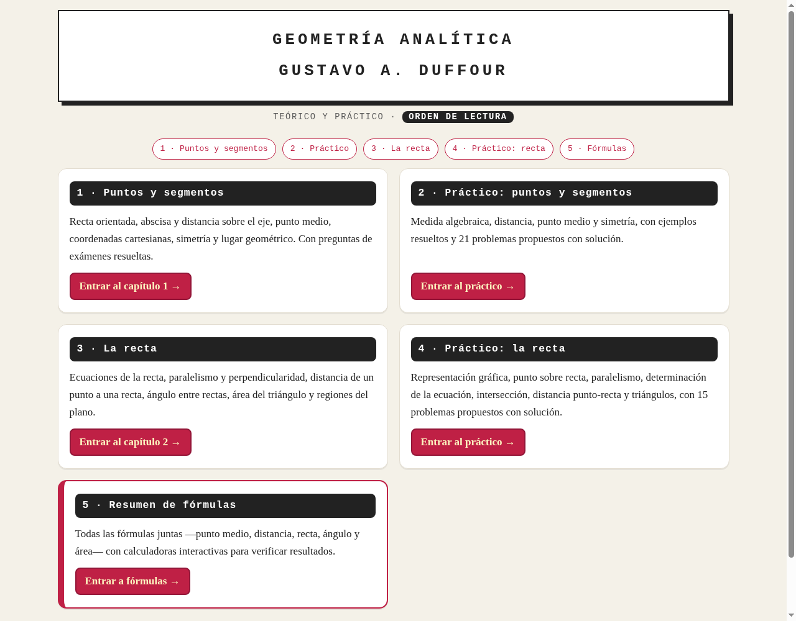
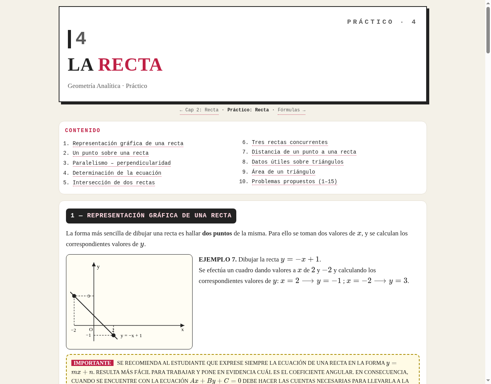

# Geometría Analítica — Duffour

Sitio estático con el teórico y práctico de Geometría Analítica
(Gustavo A. Duffour): puntos, segmentos, recta, fórmulas y calculadoras
interactivas.

🌐 **Demo:** https://geoanalitica.vercel.app



## Rutas

| Ruta | Contenido |
| ---- | --------- |
| `/` | Portada (orden de lectura) |
| `/capitulo-1/` | Puntos y segmentos |
| `/practico-puntos-segmentos/` | Práctico (21 problemas con solución) |
| `/capitulo-2/` | La recta |
| `/practico-recta/` | Práctico (15 problemas con solución) |
| `/formulas/` | Resumen de fórmulas + calculadoras |



## Stack

- Astro 7 (sitio estático, cero JS por defecto; la interactividad vive en
  el `<script>` de cada isla, sin hidratación)
- CSS vanilla con `@layer` (`tokens → base → components → page`)
- KaTeX renderizado en el build (sin JS cliente para las mates)
- pnpm · Node ≥ 22

## Comandos (pnpm — no usar npm/yarn/bun)

| Comando | Qué hace |
| ------- | -------- |
| `pnpm dev` | Servidor de desarrollo (`:4321`) |
| `pnpm check` | Solo chequeo de tipos |
| `pnpm build` | `astro check && astro build` |
| `pnpm preview` | Sirve `dist/` para verificar el build |

## Estructura

```
src/
  pages/          # Una ruta por fichero
  layouts/        # BaseLayout.astro
  components/     # .astro estáticos + calculators/ (islas)
  styles/         # tokens → base → components + un tema por página
public/assets/sprites.svg  # Sprite de figuras SVG
```

## Despliegue

Vercel, proyecto `geoanalitica`: preset **Astro**, build `pnpm build`,
output `dist`, Node 22. Cada push a `main` se publica solo.
